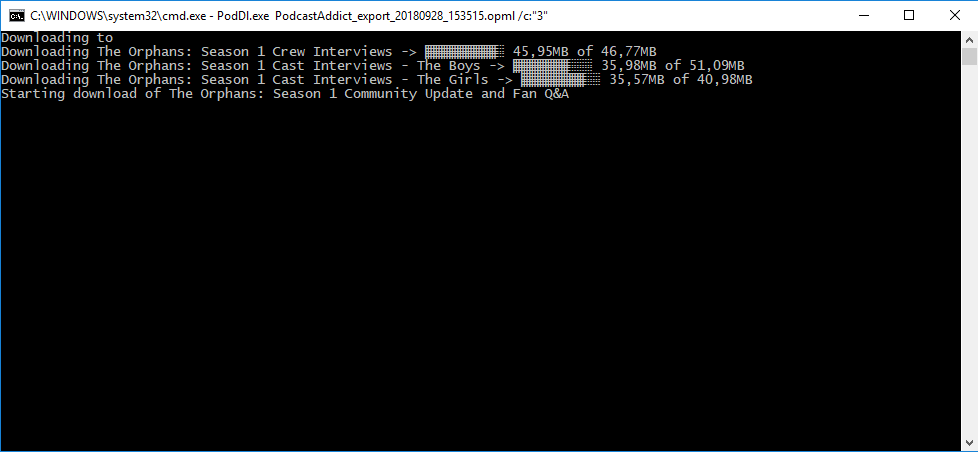
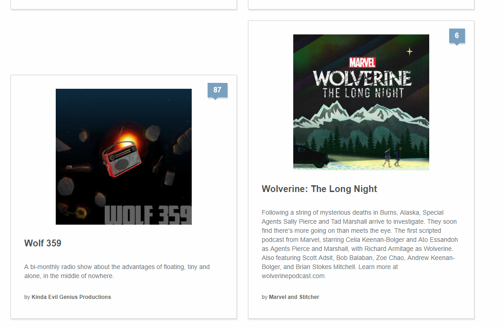
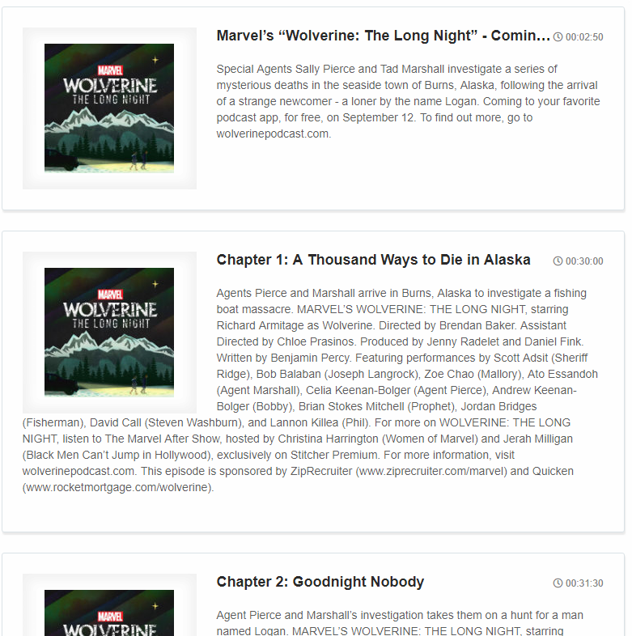

# PodDl
Archive podcasts based on RSS feeds or .opml files

PodDl is a console program written in c#. It will process a list of rss feeds from a flat file, or from an opml file and save the podcast mp3's in a specified folder.

Subfolders will be created in the output folder for each podcast downloaded. Files will be save in the format: **\<year\>.\<month>.\<day>-\<episode_title>.mp3**

## Usage examples
- PodDl.exe podcast_list.txt
- PodDl.exe /I:"podcast_export.opml" /O:"D:/Podcasts/" /C:"10" /D:"No"

## Parameters:

 - /I : Path to file containing rss feed urls. This can be either a flat file containing links on each line, or an [.opml](https://en.wikipedia.org/wiki/OPML) file. Default is a file called rss.txt in the current working directory.
 - /O: Specify an output directory. Will create subfolders for each podcast Default is current working directory.
 - /C: Number of concurrent downloads Default is 5 connections.
 - /D: Generate HTML document with Podcast info and episode lists

## Documentation example:
#### Index:

#### Episode List:

